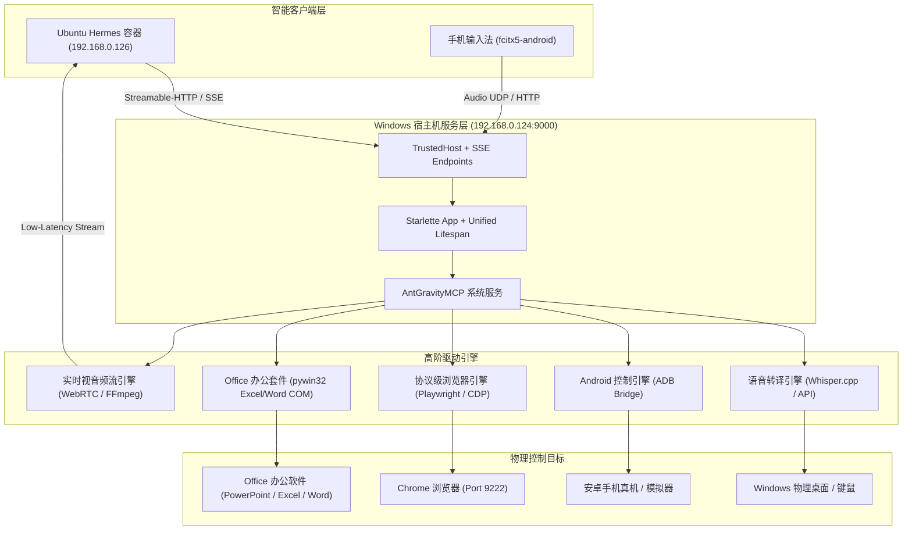

# AntGravity MCP Server — 未来功能与扩展设计方案 (DESIGN-PROPOSALS)

> **设计版本**：v1.0 (Draft)  
> **更新日期**：2026-05-20  
> **文档定位**：面向未来系统进化的多模态、跨终端 AI 控制中枢架构蓝图。  
> **目标**：以现有的 Unified Port + Windows Service 为底座，横向打通 **“语音输入、移动真机、协议级浏览器和 WebRTC 实时流”** 链路。

---

## 🗺️ 未来扩展架构全景图



---

## 🎙️ 第一部分：语音智能转译与输入法桥接系统 ( IME Bridge )

### 1. 设计初衷与场景
在移动办公或无键盘操作场景下，用户通过安卓手机（运行 `fcitx5-android` 输入法）或物理麦克风直接说出指令，系统自动识别并实时将高精度文本录入到 Windows 当前的活动编辑框内，极大提升输入效率。

### 2. 架构设计与数据流
```
[手机/物理麦克风录音] ──(PCM 音频流)──> [Unified SSE 接收端] ──> [Whisper 本地离线识别] ──(文本)──> [Win32 仿真录入]
```
- **音频采集**：支持通过局域网 HTTP POST 传输压缩音频流（如 `.wav` 或 `.opus`），亦或是开启 UDP 音频广播监听。
- **转译层**：在 Windows 宿主机部署基于 C++ 的高效率离线 Whisper 推理（`Whisper.cpp` 的 `tiny.en/small.zh` 库），内存占用小于 200MB，首字延迟控制在 500ms 内。
- **动作执行**：调用 Win32 API 捕获当前 Focus 状态下的前景窗口，通过输入模拟将文字敲入。

### 3. 新增工具接口规范
* **`ag_voice_listen(duration: int = 5, sample_rate: int = 16000)`**：
  * **作用**：让 Windows 本地麦克风开启录音，并返回音频文件的本地 SHA256 标识。
* **`ag_voice_transcribe(audio_path: str, insert_active: bool = True)`**：
  * **作用**：运行离线 Whisper 推理转译目标音频。若 `insert_active` 为 True，转译完成后自动仿真敲入当前键盘活动焦点处。

---

## 📱 第二部分：安卓真机及模拟器自动化操控系统 ( Mobile-Agent )

### 1. 设计初衷与场景
很多开发工作（包括 Android 软件自动化编译、UI 适配测试、真机功能跑通）需要在手机上完成。该模块让远程 Hermes 能像操控 Windows 桌面一样，同时接管 Windows 物理机上连接着的安卓手机。

### 2. 架构设计与数据流
```
[Hermes 客户端] ──> [MCP AdbEngine] ──(ADB API)──> [UI 树 XML 转换] ──> [坐标定位/模拟点击]
```
- **布局抓取**：利用 `adb shell uiautomator dump` 获取手机当前运行画面的布局 XML。
- **元素映射**：解析 XML，提取元素的 `resource-id`、`text`、`bounds`（边界坐标）。
- **设备适配**：自动换算手机物理分辨率与边界坐标，支持多真机并联管理（`adb -s <serial> ...`）。

### 3. 新增工具接口规范
* **`ag_adb_snapshot(device_id: str = None)`**：
  * **作用**：截取当前 Android 设备的屏幕（截图），并导出经过坐标缩放处理的完整交互 UI 结构列表（包含文本和对应的坐标点）。
* **`ag_adb_click(loc: list = None, label: str = None, device_id: str = None)`**：
  * **作用**：根据像素坐标 `[x, y]`，或模糊匹配元素的文字/ID，向安卓手机发送物理点击指令（`adb shell input tap`）。
* **`ag_adb_type(text: str, loc: list = None, device_id: str = None)`**：
  * **作用**：激活文本框并输入特定内容。

---

## 🌐 第三部分：Chrome DevTools Protocol (CDP) 隐形无损浏览器控制

### 1. 设计初衷与场景
模拟鼠标键盘控制网页容易受到动态分辨率变化、广告弹窗、页面动态加载以及输入法冲突的干扰。本模块允许 AI 在**不移动用户物理鼠标**的前提下，直接在底座内无损抓取与操纵浏览器。

### 2. 架构设计与数据流
```
[Windows 宿主机运行 Chrome Debug 端口 9222] ──> [Playwright CDP 连接] ──> [直接控制 DOM 树与 JS]
```
- **免冷启动挂载**：不需要每次新建无头浏览器，直接连接已经在运行的 Chrome 主进程端口（`http://localhost:9222`），AI 可无缝访问用户已经登录好的各种工作网站（如 GitHub、邮箱、内网平台等）。
- **零干扰操作**：AI 在网页内的翻页、点击、输入完全在后台静默发生，不会抢占用户的实际鼠标焦点。

### 3. 新增工具接口规范
* **`ag_chrome_get_dom(url: str = None)`**：
  * **作用**：如果提供了 `url` 则在活动标签页中跳转；若为空，则直接抓取并过滤当前活动标签页的干净 DOM 层次与可见表单元素。
* **`ag_chrome_cdp_eval(script: str)`**：
  * **作用**：在当前浏览器上下文直接执行任意 JavaScript 语句，并同步返回执行结果。
* **`ag_chrome_action(selector: str, action: str = "click", value: str = None)`**：
  * **作用**：基于 CSS Selector 精准定位网页上的输入框或按钮，执行点击或输入。

---

## 📊 第四部分：Office 办公自动化全面进化 ( Excel / Word )

### 1. 设计初衷与场景
已成功实现的 PowerPoint COM 驱动模式非常受 AI 青睐。在此基础上打通 Excel（高维数据计算、报表分析）与 Word（复杂技术提案与报告撰写），可全面替代传统的静态 Office 生成库（如 `openpyxl`，它们往往会损坏复杂表格的原生排版和 VBA 宏定义）。

### 2. 架构设计
- 基于 `comtypes.client` 或 `win32com.client` 挂载已打开的 `Excel.Application` 和 `Word.Application`。
- **无损公式保持**：AI 仅读取或写入特定单元格的 `.Value`，而保留表单内原有的图表绑定、透视表定义和高阶计算公式。

### 3. 新增工具接口规范
* **`ag_excel_read_range(sheet_name: str, start_cell: str, end_cell: str)`**：
  * **作用**：高精度读取 Excel 指定表单内的数据矩阵，转为干净的 Markdown 表格返回给 AI。
* **`ag_excel_write_cell(sheet_name: str, cell: str, value: any)`**：
  * **作用**：对指定单元格（如 `"B12"`）注入数值、日期或计算公式（如 `"=SUM(B1:B11)"`）。
* **`ag_word_generate(template_path: str, placeholders: dict)`**：
  * **作用**：读取指定的 Word 模版，精准替换模版中由 `{}` 定义的标签段落。

---

## 📡 第五部分：WebRTC 极低延迟视音频流实时同步

### 1. 设计初衷与场景
在进行高频人机协作或进行复杂多模态操作时，AI 每次调用 `Screenshot` 都会造成约 300ms 的停顿。建立一个轻量级 WebRTC 直播视频流能让远程 AI 或协作者在几毫秒内获得 Windows 宿主机的动态响应画面。

### 2. 架构设计与数据流
- **低时延渲染**：通过 `aiortc` 在 python 底层搭建 WebRTC 挂钩，使用 Windows 内置的 Desktop Duplication API 实现 GPU 级零拷贝的高速截屏。
- **传输控制**：将视频流编码为低码率、低带宽占用的 H.264，并通过网络单向推流至远程的 Hermes 控制面板或移动端监视器。

### 3. 新增工具接口规范
* **`ag_stream_start(fps: int = 15, bitrate: int = 1000)`**：
  * **作用**：拉起 WebRTC 编码器并生成流媒体连接信令（SDP Offer/Answer），建立长视频流。
* **`ag_stream_stop()`**：
  * **作用**：优雅断开流媒体传输，释放 GPU 和编码资源。
